# Assignment

##Installation
First, cloning the ur5 package, there were errors with turning on gazebo. The table was missing and the mimic_joint_plugin from robotiq had errors. This was solved by updating the code to work for gazebo 9. Some controllers were missing, these were installed.
Then adding the stereo camera. I choose to use the Realsense D435 as I had used that for a previous project. The package was installed and the sensor added to the robot urdf. 
To use moveit as a planner, the universal_robot package was cloned. The code was changed to work with an additional sensor and to have the Realsense d435 publish its pointcloud to the right topic for the octomap. 

##Continuation
Below all the currently implemented steps are explained and shown. Due to the time cost of getting the setup working, these steps are fairly basic to achieve the result. Next steps to implement (with more time) would be to use the d435 to recognize the cubes. For this I would use icp with the pointcloud. Then, add these recognized boxes to the planning scene and remove them from the octomap (currently not removing them is error prone). Then, the commands for picking and placing could be changed depending on the determined position of the cube instead of fixed locations. Adding known items to the planner and removing those from the octomap could prevent errors, such as the arm colliding with the table it is placed on. 

Furthermore, the octomap is slow. I could not determine whether that was due to my laptop or if the integration was improper, so I decided to leave that until I would have a stronger laptop or pc to work with.

The current obstace is very simple but improving the octomap could make this a more complex scene.

##Steps
First, launch 2 terminals, or one with 2 tabs. 
Go to the right folder, for me:

`cd catkin_ws`

Then source

`source devel/setup.bash`

In the first terminal, launch the assignment

`roslaunch ur5_gazebo Assignment.launch`

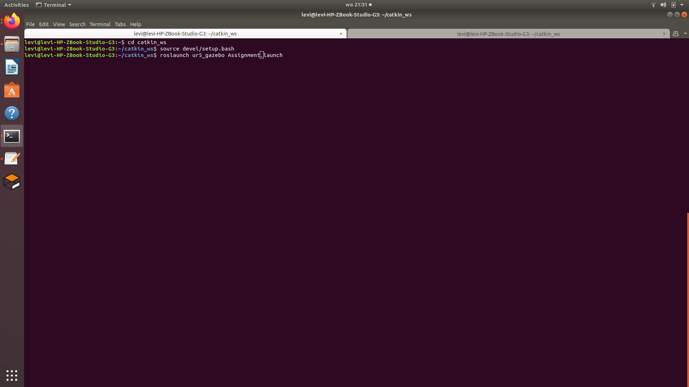

This launches gazebo first. Gazebo starts pauzed, press play to continue the boot (RVIZ will be waiting)

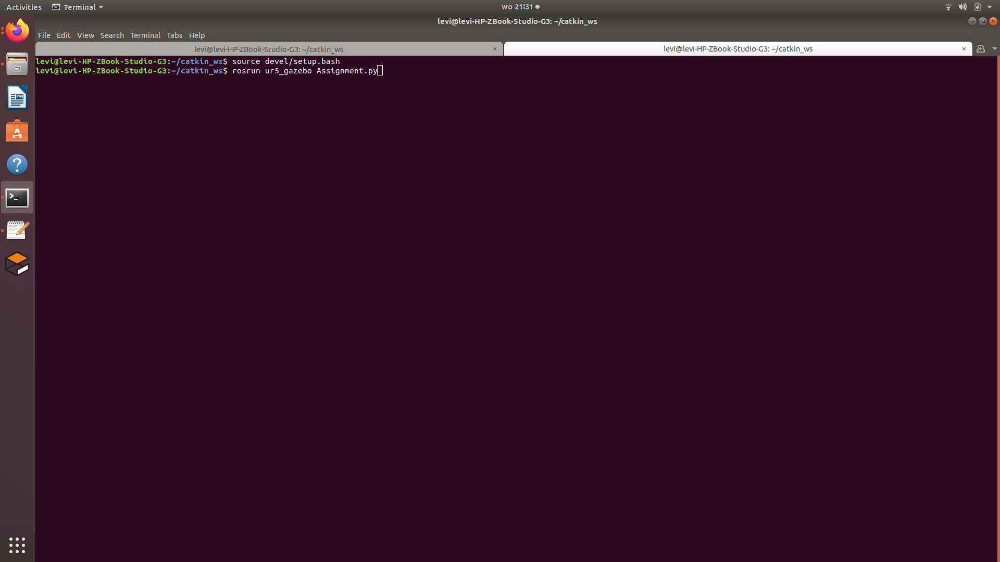

After the boot, I used a 2 screen setup to see the code, gazebo and rviz at the same time.

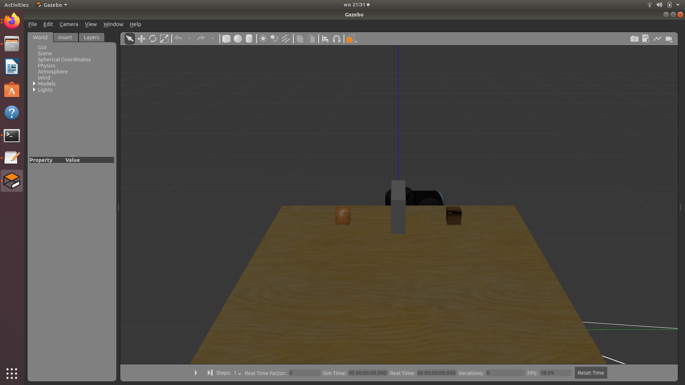

Wait until the first terminal says "you can start planning now" in green before continuing to the second terminal, then run the python file

`rosrun ur5_gazebo Assignment.py` 

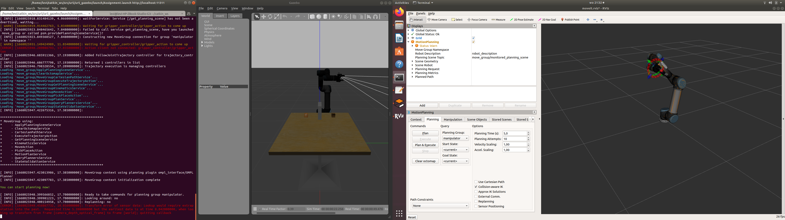

The python file is made that the screen prints what happens at each step. Images are inserted below to show each step.

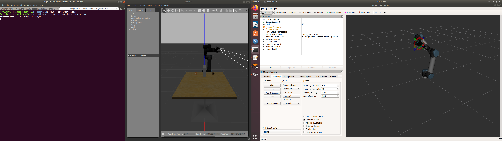
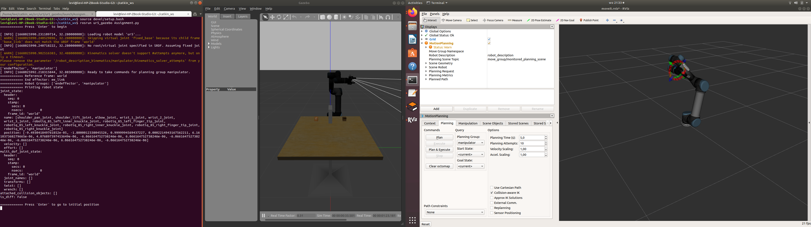
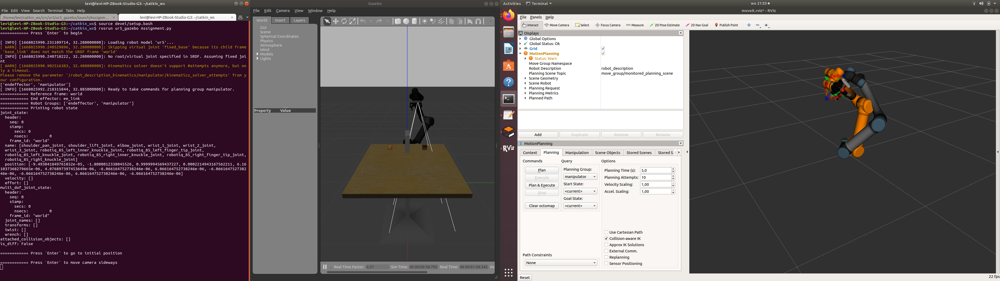
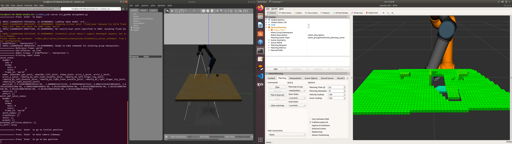
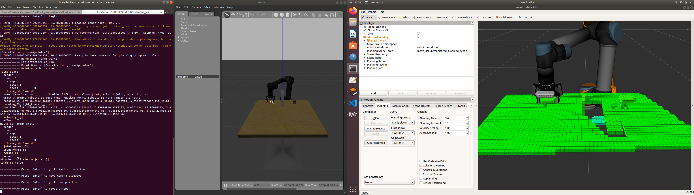
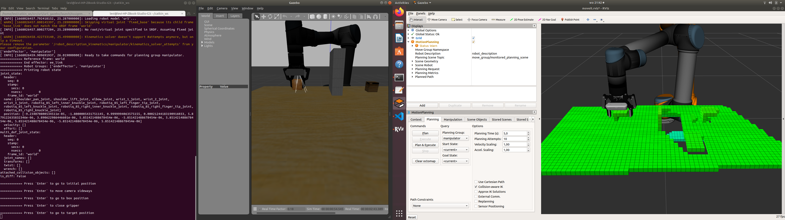
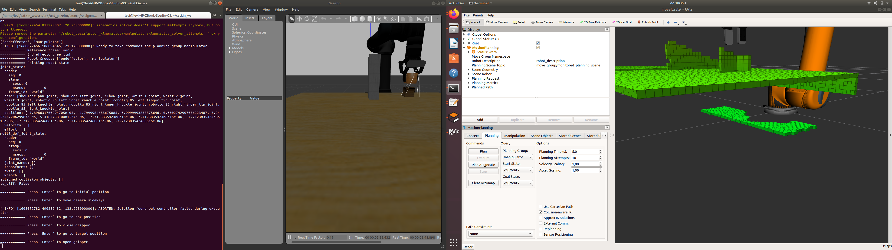
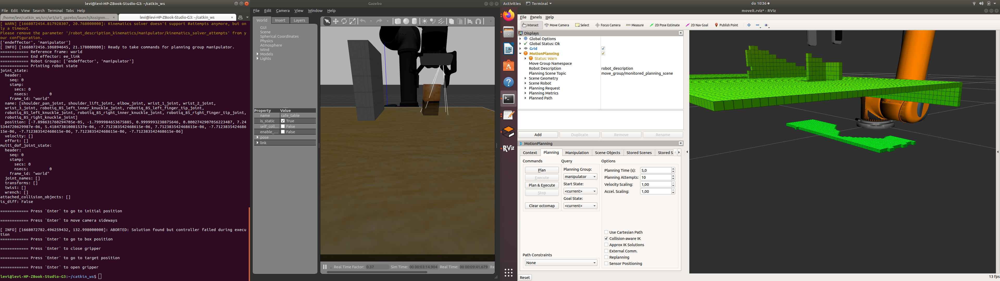
